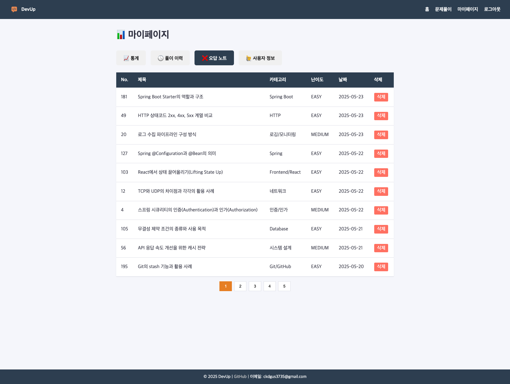

# README

## 🌐 배포 주소

> 🟢 <strong>실 서비스 바로가기 → <a href="https://devup.p-e.kr" target="_blank">https://devup.p-e.kr &#8599;</a></strong>


## 📌 프로젝트 개요

> 기술 면접 질문 탐색과 오답 복습 기능을 제공하는 웹 서비스

### 🎯 목표

- 자주 출제되는 기술 면접 질문을 직접 수집하고 정리
- 문제 풀이와 정오답 기록을 통해 반복 학습 구조 제공
- 면접 질문에 대한 답변을 연습하고, 정오답을 기록해 실력을 체계적으로 향상시킬 수 있도록 지원

### 🧐 버전 전략

| **버전**   | **설명**                                                   |
|----------|----------------------------------------------------------|
| **v1.0** | - 사용자 기능 중심(문제 풀이, 오답노트, 학습 통계 등)                        |
| **v1.1** | - 관리자 기능 추가(질문 관리, 사용자 관리 등)  <br>- 북마크<br>- 많이 틀린 질문 모음 |
| **v2.0** | - AI 기능 추가(면접 답변 평가, 추천 등)                               |

### ✅ 개발 정보

- **개발 기간**: 2025.04 ~ 2025.05
- **개발 방식**: 개인 프로젝트
- **작업 내용**: 기획, DB 설계, 백엔드 개발, 프론트 연동 및 배포

### 🔧 기술 스택

| 영역           | 스택                                                             |
|--------------|----------------------------------------------------------------|
| **Backend**  | `Java 17`, `Spring Boot`, `Spring Security`, `Spring Data JPA` |
| **Frontend** | `Thymeleaf`, `HTML`, `CSS`, `JavaScript (Vanilla)`             |
| **Database** | `MariaDB`, `H2 (로컬 테스트용)`                                      |
| **Infra**    | `AWS EC2 (배포 예정)`, `IntelliJ`, `Gradle`, `GitHub`              |


---

## 🔎 주요 기능

### 🧩 1. 면접 질문 목록 조회
- 주제, 난이도, 키워드 기준으로 문제 탐색할 수 있음
- 페이지네이션, 제목 검색 기능 제공
- 비회원도 열람 가능
- 문제는 최신순으로 정렬

### 📄 2. 면접 질문 풀이
- 정답은 답안 입력 후 `[정답 보기]` 버튼 클릭 후에만 보이도록 구성
- 비회원도 풀이 가능하지만, 풀이 기록은 저장되지 않음

### 📝 3. 사용자 풀이 이력 관리
- 사용자의 풀이 이력을 저장하고 최근 푼 순으로 정렬
- 문제 제목, 카테고리, 난이도, 정답 여부 등을 함께 표시

### ⚠️ 4. 오답노트
- 오답만 자동으로 모아 보여주는 기능
- 오답은 사용자의 풀이가 틀렸을 때마다 저장됨
- `[삭제]` 버튼을 클릭해 삭제할 수 있음

### 📊 5. 마이페이지 통계
- 총 풀이 수, 정답률, 분야별 학습률 등을 시각적으로 제공
- 통계 데이터는 문제를 풀 때마다 자동 갱신됨

### 🪪 6. 회원가입 및 로그인
- 로그인 후에는 JWT 토큰 발급 및 인증 처리
- 로그인 시 비밀번호는 Bcrypt로 암호화
- `Spring Security` 기반으로 인증, 인가 구성

---

## 🚨 실행 전 설정

### `.env` 파일 생성
- 프로젝트의 환경 변수는 `.env` 파일에서 관리
- 루트 디렉토리에 `.env` 파일을 생성하고, 아래와 같이 환경 변수를 설정
```text
#JWT 설정
JWT_SECRET_KEY=your_jwt_secret_key
JWT_ISSUER=your_jwt_issuer
JWT_EXPIRATION=your_jwt_expiration  # 1시간 = 3600000
```
> `.env` 파일은 Git에 커밋되지 않도록 `.gitignore`에 포함되어 있음

---

## 🧪 실행 방법

> Java 17 이상, Gradle 8.13 사용(`./gradlew` 기준)
>
```bash
# 1. 프로젝트 클론
git clone https://github.com/your-username/devup.git

# 2. 디렉토리 이동
cd devup

# 3. 실행
./gradlew bootRun
```

---

## 🖼 화면 예시

| 📂 문제 목록 화면                                                                    | 🧩 면접 질문 풀이 화면                                                                   |
|--------------------------------------------------------------------------------|----------------------------------------------------------------------------------|
|  |  |

| 📝 사용자 풀이 이력 화면                                                                 | ⚠️ 오답노트 화면                                                                        |
|---------------------------------------------------------------------------------|-----------------------------------------------------------------------------------|
|  |  |

| 📊 마이페이지 통계 화면                                                            | 🪪 로그인 화면                                                              |
|---------------------------------------------------------------------------|------------------------------------------------------------------------|
|  |  |

---

## 🏗️ 시스템 아키텍처


---

## 🗂️ 프로젝트 구조

```
devup/
└── src/
    └── main/
        ├── java/
        │   └── com/devup/
        │       ├── auth/       # 인증/인가 관련
        │       ├── global/     # 전역 설정, 예외, 응답 포맷
        │       ├── question/   # 면접 질문 기능
        │       ├── user/       # 사용자 정보 및 마이페이지
        │       └── wrongnote/  # 오답노트
        └── resources/
            └── static/         # 정적 리소스 (JS, CSS, favicon 등)
```

---

## 🏞️ ERD (v1.0 기준)


